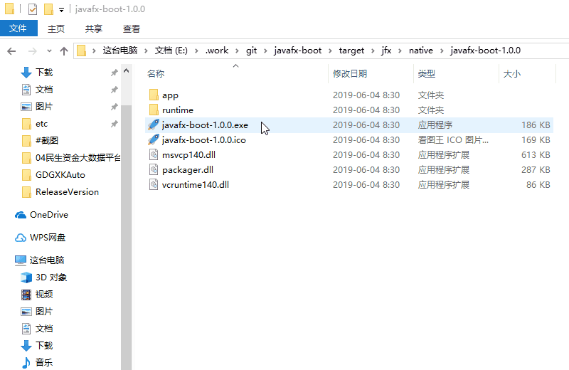

#### JavaFX系列框架项目导航
- **[JDK8 & JavaFX & SpringBoot](https://gitee.com/westinyang/javafx-boot)** `加持SpringBoot，项目示例，Maven打包插件带可执行程序`
- [JDK8 & JavaFX](https://gitee.com/westinyang/javafx-start) `不依赖SpringBoot，项目示例，Maven打包插件带可执行程序`
- [JDK11+ & JavaFX15](https://gitee.com/westinyang/javafx-jdk11-start) `模块化，jlink打包为本机镜像，精简jvm，7z压缩后仅16M`

---


# javafx-boot

#### 介绍
JavaFx+SpringBoot快速开始脚手架，应用示例。非SpringBoot版本请移步至该仓库：[javafx-start](https://gitee.com/westinyang/javafx-start)

> 参考资料：https://segmentfault.com/a/1190000014037443

Maven插件
- [springboot-javafx-support](https://github.com/roskenet/springboot-javafx-support)
- [JavaFX Maven Plugin](https://github.com/javafx-maven-plugin/javafx-maven-plugin)

#### 配置（application.yml）

```yaml
javafx:
  title: JavaFx & SpringBoot
  appicons: /icon/icon.png
  stage:
    width: 640
    height: 480
#    style: DECORATED  # javafx.stage.StageStyle [DECORATED, UNDECORATED, TRANSPARENT, UTILITY, UNIFIED]
#    resizable: false
```

#### 运行效果



#### 打包教程

`mvn jfx:native`

#### 参与贡献

1. Fork 本仓库
2. 新建 Feat_xxx 分支
3. 提交代码
4. 新建 Pull Request
